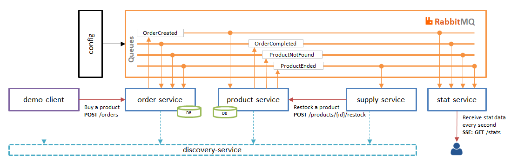
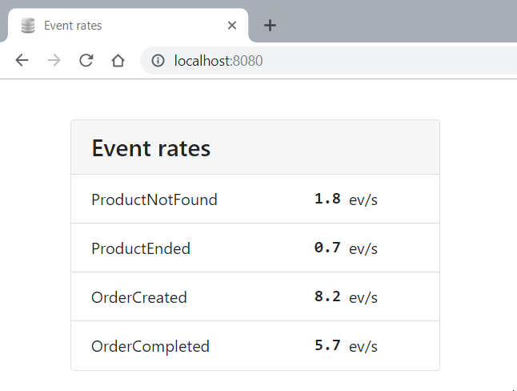

# Spring Cloud Stream demo

A demonstration of using [Spring Cloud Stream][1] with [RabbitMQ][2] 
to transfer messages between micro-services.

## Used stack

- Java 11
- Spring Boot
- Spring Cloud Stream / Spring Cloud Stream Reactive
- Spring Cloud Stream RabbitMQ Binder
- Spring Cloud Netflix / Eureka (discovering and load balancing)
- Spring Web / Web Flux
- Spring Data JPA / Hibernate
- Spring Retry
- Spring Actuator
- FlyWay
- Bootstrap & JavaScript
- PostgreSQL
- RabbitMQ
- Docker / Docker Compose

## Architecture

 

## Workflow

1. Client 'wants' to buy a product and sends a POST request with specific `productId` 
to `order-service`. By default the `demo-client` sends such requests every 200 ms.
2. Order service receives 'buy a product' request then creates new order, stores it
to the local DB, then sends event `OrderCreated` to the message broker.
3. Product service has subscribed on `OrderCreated` event. When the service received the event 
it tries to 'sell' the product. If the specified product exists and its amount is not zero
then the service reduces its amount per unit, and sends the event `OrderCompleted`.
If the product not found then the service sends `ProductNotFound` event. If the product amount
is zero then service sends `ProductEnded` event.
4. Order service received these events and mark the order respectively: completed or failed.
5. Supply service has subscribed on `ProductEnded` event. When it received the event
then it sends a POST request to `product-service` to restock the product with some value.
6. Stat service listens to all kind of the events, calculates their rates for the last 10 seconds,
and sends it with SSE (Server Sent Event) to a subscriber (if there is one) every 1 second.      
 
## Peculiarities

1. To configure the routes of the events in the message broker the [config application][3] is used.
It should be run only once before starting the rest of the services. With Spring Cloud Stream 
the routes are configured pretty simple in the [Routes interface][4] and the [application properties file][5].     
2. To avoid locking in the DB of the Product service, when several threads and/or several instances 
of the service will try to modify the amount of the particular product, Optimistic Locking and Spring Retry
are used.

## Play with the demo

You should have Java 11, Git, Maven, Docker and Docker Compose be installed.

1. Clone this project and `cd` to its folder
2. Build the project with maven:
```shell script
mvn package
```
3. Move to `demo` folder
```shell script
cd demo
``` 
4. Run the environment:
```shell script
docker-compose up -d --build
```
5. Open browser on `http://localhost:8080` to see the statistics:

6. Stop the environment:
```shell script
docker-compose down
```

You can increase system load and performance by scaling instances of the services and `demo-client`.
For example, scaling `demo-client` and `product-service`:
```shell script
docker-compose up -d --scale demo-client=2 --scale product-service=2
```
 
 
[1]: https://spring.io/projects/spring-cloud-stream
[2]: https://www.rabbitmq.com/
[3]: config
[4]: config/src/main/java/io/github/cepr0/demo/config/ConfigApplication.java
[5]: config/src/main/resources/application.yml